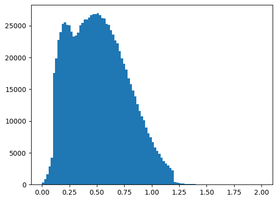

# Dokumentacja narzędzia do automatyzacji rozgrywki

## Podstawowe założenia i cele
- Projekt w swoim zamyśle ma na celu być jak najbezpieczniejszym narzędziem do automatyzacji rozgrywki, dalej zwany botem, macro. Poprzez zastosowanie rozwiązań opierających się na naśladowaniu gracza, tj. klikania myszką i klawiaturą, zachowujemy się bardziej jak człowiek, niż jak bot, co zmniejsza naszą szanse na wykrycie niepożądanych inputów przez grę. Większość botów korzysta z wyciągania informacji bezpośrednio ze strony (co zwiększa podejrzany traffic na stronie) i na tej podstawie podejmuje działania, ten projekt natomiast opiera się na tym co widzi na ekranie. <br>
- Bot ma na celu zdobywanie przedmiotów poprzez pokonywanie przeciwników, a następnie sprzedanie ich u handlarza i powtarzórzenie cyklu.


```python
from func import *
from const import *
from visualization import *
```

## Czas pomiędzy akcjami gracza


Funckja wait() ma naśladować czas z jakim gracz średnio wykonuje swoje akcje. Zastosowany został rozkład normalny w odpowiednich proporcjach. Wykres reprezentuje rozkład czasu dla miliona prób. Jak widać około 90% wyników mieści się między 0.1-0.8 sekundy, przez co w rzeczywisty sposób odzwierciedla czas pomiędzy akcjami gracza. W programie te czasy są traktowane wektorowo tzn. można je mnożyć oraz dzielić przez określone stałe w celu usprawnienia działania konkretnych części programu. 


```python
def wait():
    x = np.random.normal(0.5,0.3,1)
    if x < 0 :  return float(-x + random.randrange(0,200)/1000)
    if x < 0.1 :return float(x + random.randrange(50,200)/1000) 
    if x > 1.2 : return float(x - random.randrange(0,500)/1000)
    return float(x)
```


```python
create_hist(1000000) #uzycie milion razy funkcji wait() i jej wizualizacja
```


    

    


# Algorytm wyszukiwania i pokonywania przeciwników

